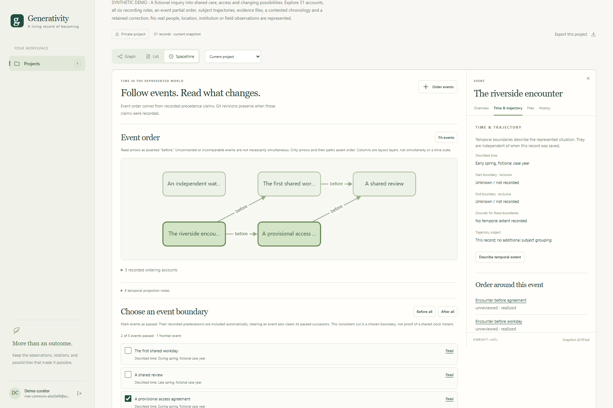
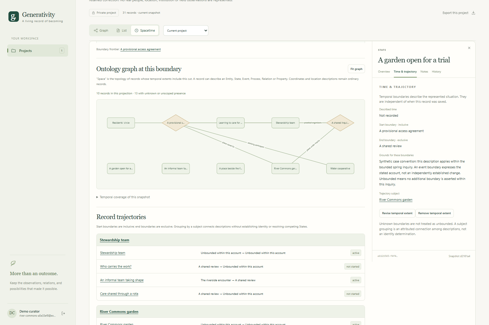
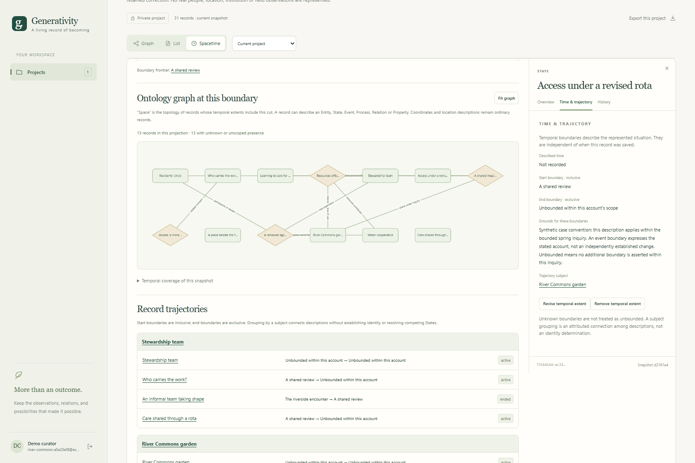
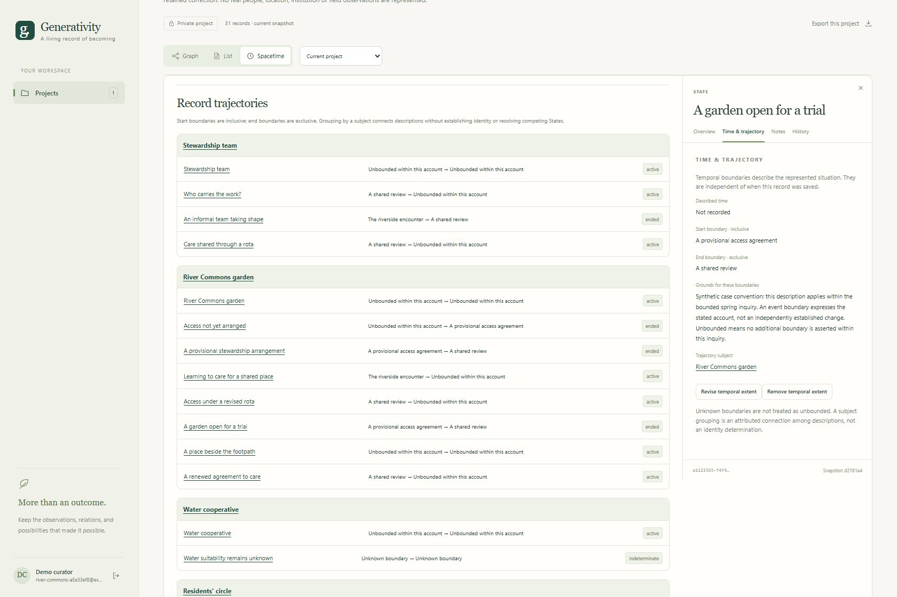
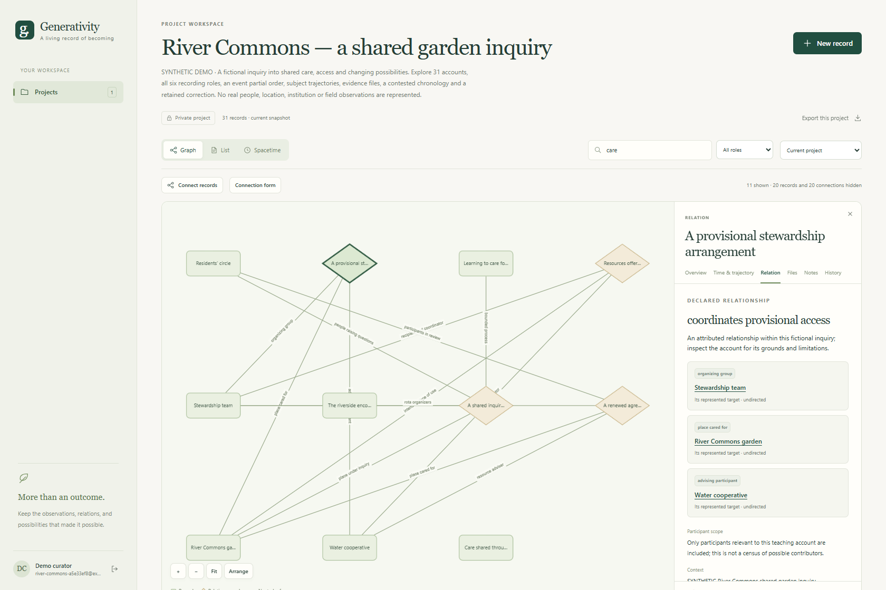
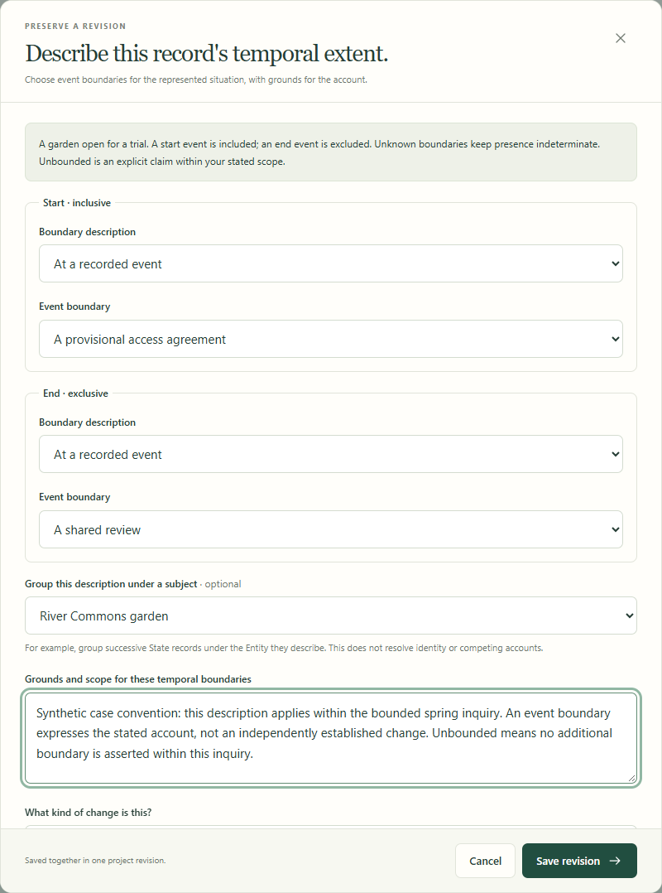
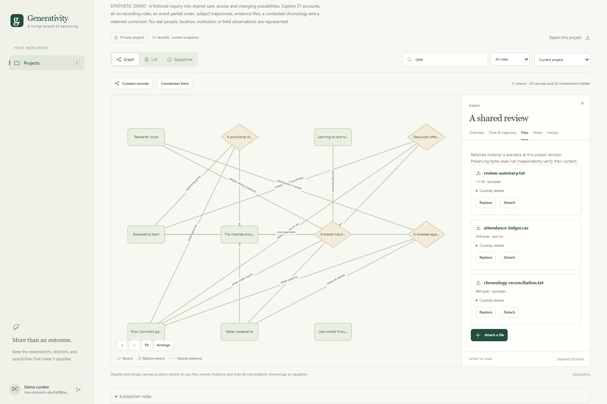
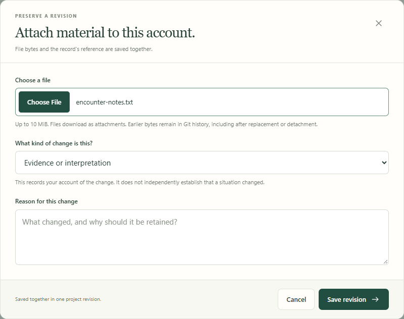
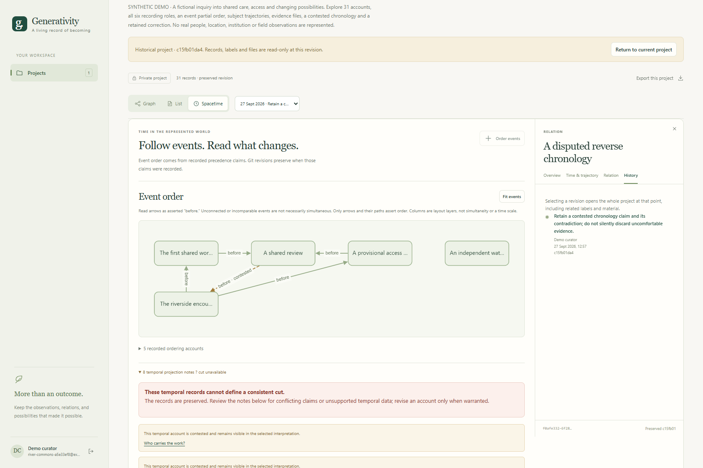
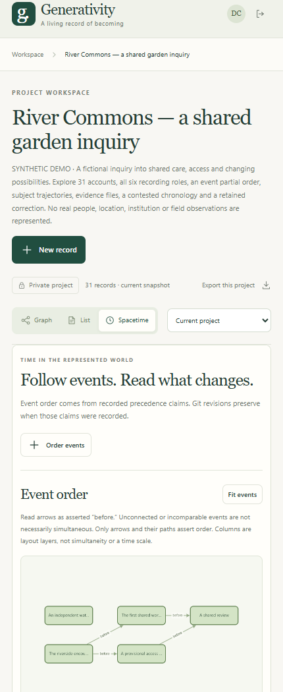

# River Commons gallery

**Class:** Informative application demonstration  
**Status:** Synthetic example of the experimental generalized application

The River Commons project follows a fictional inquiry into shared care of a garden. Its 31 records include all six operational roles, five Events, scoped State descriptions, qualified Relations, notes, six retained files, an unrealized alternative and a corrected chronology. Every account and source file is invented.

These images are generated from the running application and its retained project, using ordinary controls. They are screenshots, not UI mockups. See the [demo guide](../../web_application/demo/README.md) for the story, local account setup and reproduction commands. The generated [capture manifest](manifest.json) records source and project revisions, viewport dimensions and image hashes without credentials.

## See the visualized spacetime

Read the following views together: **event precedence defines possible boundaries; a selected boundary reveals an ontology topology; subject trajectories connect scoped descriptions across those boundaries.** Here, "space" means the topology of applicable ontology records. Selecting a boundary changes the view of one retained account, without creating a Git revision.

### Event order defines the available boundaries

**2. A partial order of represented events.** The later review was recorded first; the encounter and other earlier events were added retrospectively. Recorded precedence branches from the encounter through the agreement and workday, then reaches the review. The agreement and workday have no established mutual order. The independent water observation has no established order relative to the other events. Incomparable events are not asserted simultaneous, and horizontal positions are layout rather than a clock scale.

### The ontology topology changes with the selected boundary

The two screenshots below use the **same current Git revision**. Their boundary labels identify different selections of passed events. Recorded predecessors are included automatically.

| Chosen boundary | Events included | Records in the topology | Accounts to compare |
|---|---|---:|---|
| After the provisional access agreement | Encounter and agreement: 2 of 5 | 10 | Trial access and provisional stewardship apply |
| After the shared review | Encounter, agreement, workday and review: 4 of 5 | 13 | Revised access, rotating care and renewed stewardship apply |

**3. After the access agreement.** The selected State, **A garden open for a trial**, and the Relation **A provisional stewardship arrangement** apply at this boundary. The workday is outside the chosen cut: no retained claim orders it before the agreement. Records with unknown or unscoped presence remain separately inspectable.

**4. After the review.** Both branches now lie before the selected boundary. The trial State and provisional arrangement have ended within this account. **Access under a revised rota**, **Care shared through a rota** and **A renewed agreement to care** are applicable. The independent observation is still outside this cut and remains unordered. These changes follow declared temporal extents; the visualization does not infer that an event caused them.

### Subject trajectories connect the scoped descriptions

**5. Follow changing and competing descriptions.** Under **River Commons garden**, the State accounts describe **Access not yet arranged**, then **A garden open for a trial**, then **Access under a revised rota**. Their inclusive start and exclusive end boundaries connect them to the agreement and review. The provisional and renewed stewardship Relations have their own extents under the same subject.

Under **Stewardship team**, **An informal team taking shape** ends at the review and **Care shared through a rota** becomes applicable. The workload concern remains visible beside those descriptions. Subject grouping does not independently establish identity, continuity or agreement. Unknown water applicability remains indeterminate; it is not placed into a definite period merely to complete the picture.

To explore these views, open **Spacetime**, choose **Before all**, then mark **A provisional access agreement** as passed. Read the topology and trajectories, then mark **A shared review** as passed and compare. Keep **Current project** selected throughout; no project revision is saved by these controls.

## Records and their relationships

**1. A record graph with inspectable Relations.** The selected arrangement has its own account and named participant roles. The visible search query **care** shows 11 of the project's 31 records for readability; it does not remove the other records. The capture script arranges these nodes into a local display grid, equivalent to manual dragging, without changing records or connections. Graph layout does not establish causation or chronology.

## Describe temporal scope

**6. Record the grounds for temporal scope.** The actual editor distinguishes event, unknown and unbounded boundaries, and retains the stated basis and optional subject grouping. This pictured editor is opened for the trial-access State and canceled during capture.

## Retained materials and usable controls

**7. Material accompanies the account.** Fictional review evidence is retained through the Files module, with download links and custody details. Preserving bytes establishes what was retained, rather than independently verifying their content.

**8. Attach material through the real upload dialog.** The native file chooser uses the application's button styling. The selected synthetic file is a screenshot-only draft; capture discards it instead of creating a duplicate attachment.

## Preserve contradictions and their revision

**9. A historical contradiction remains inspectable.** This pinned revision contains the mistaken claim that the review preceded the encounter. The cycle prevents a consistent temporal cut. The current account withdraws that claim while retaining this historical record; it also corrects the reported attendance from 18 entries to 16 distinct attendees. Those are revisions of the account, not changes to past events.

## A narrow viewport

**10. The same project on mobile.** Ordinary workspace controls and the event-order view remain available at a 430-pixel viewport. This bounded screenshot shows a portion of the scrollable workspace.

## Capture and preview maintenance

The [capture script](../../web_application/demo/capture.py) reads the synthetic project's saved revision, operates the UI, captures these ten images and checks that the project head remains unchanged. Its generated manifest describes the particular capture; this gallery is not a substitute for application test results.

Five deliberate preview copies are generated inside each of the programme and infrastructure repositories for their READMEs:

| Canonical screenshot | Parent preview filename |
|---|---|
| `01-record-graph.png` | `generalized-record-graph.png` |
| `02-event-order.png` | `generalized-spacetime.png` |
| `03-earlier-topology.png` | `generalized-spacetime-earlier.png` |
| `04-later-topology.png` | `generalized-spacetime-later.png` |
| `05-subject-trajectories.png` | `generalized-spacetime-trajectories.png` |

The copy mapping and source hashes are recorded in the manifest. Keeping previews inside each repository avoids broken image paths across Git submodule boundaries. The complete gallery and reproducible demo sources remain here in the generalized application repository.
